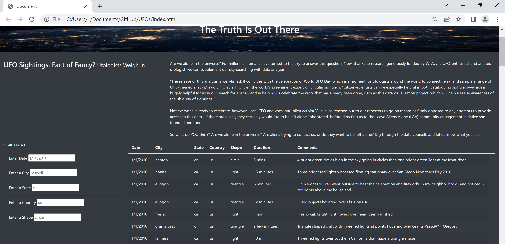

# UFOs

## Overview of the analysis
To create a webpage and dynamic table that contains UFO's data. In addition, to create in-depth analysis of UFO sightings by allowing users to filter for multiple criteria(city, state, country, and shape) at the same time. In addition to the date, you’ll add table filters for the city, state, country, and shape.

## Results

The result of the complited job is fully functional webpage that when opened shows unfiltered UFO Sightings. To narrow the data a user can search be one ore more criteria (date,city, state, country, and shape)
