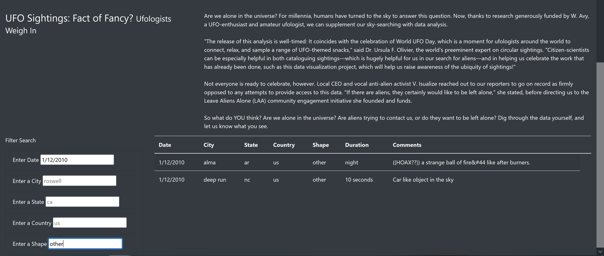

# UFOs

## Overview of the analysis
To create a webpage and dynamic table that contains UFO's data. In addition, to create in-depth analysis of UFO sightings by allowing users to filter for multiple criteria(city, state, country, and shape) at the same time. In addition to the date, you’ll add table filters for the city, state, country, and shape.

## Results

The result of the completed job is a fully functional web page that when opened shows unfiltered UFO Sightings. To narrow the data a user can search be one or more criteria (date,city, state, country, and shape)

## Summary
Although, the web page is fully functional there are some drawbacks and upgrades suggestion:

### Drawbacks
A user should manually fill the search criteria so there should be a drop menu that offers a user possible options for criteria and increases usability.

### Recommendations for future developments:
1. To allow users to search by UFO duration time.
2. To develop a possibility of adding a picture and video of UFO if they exist.
